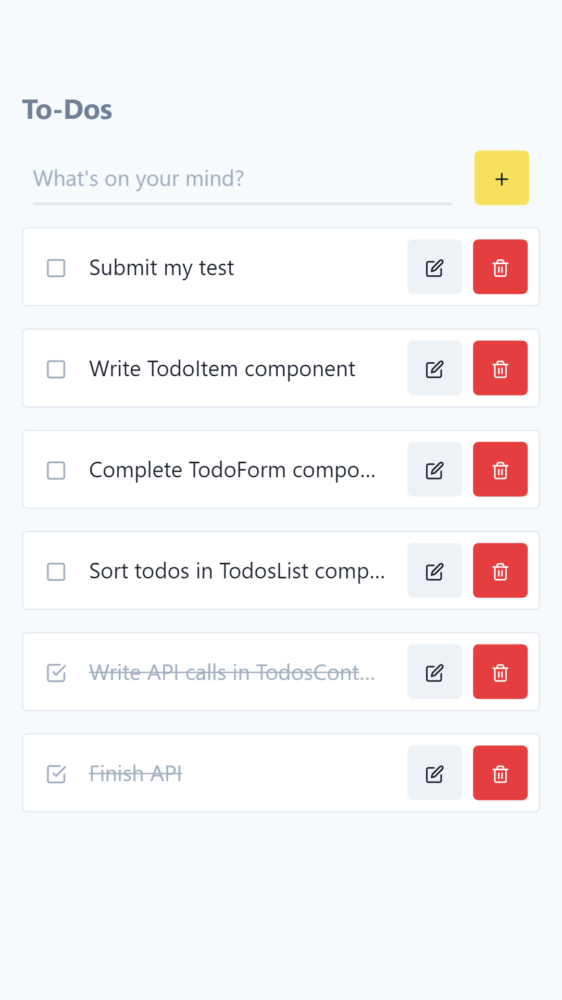
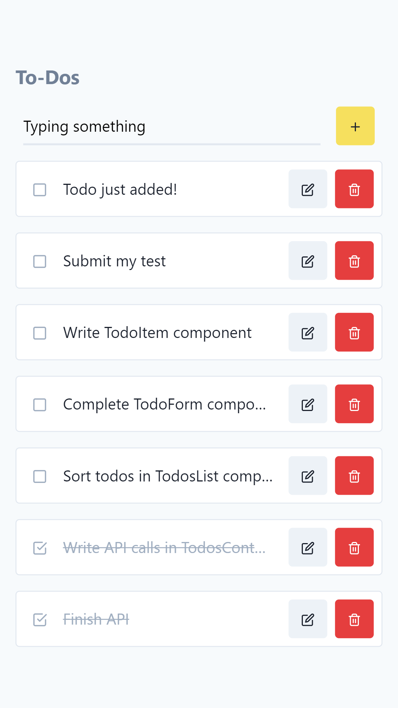
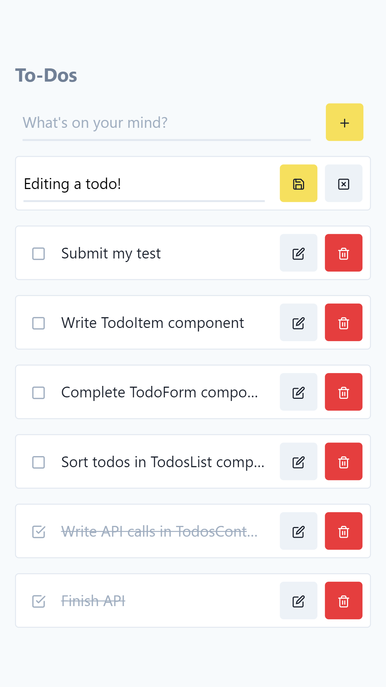

<p align="center"></p>

# Epycure front-end test

To demonstrate your front-end skills, you are asked to **fill the gaps in a basic To-Dos list React web-app**, served by a Node+Express server.
The test is quite short, and **has been designed to be completed in about 2 hours**.

We'll discuss your work (choices, code syntax, mistakes if there are some, etc.) during a review call after you have completed the assignment.

**Carefully read all the instructions, then give yourself a limited time.**
If you struggle to finish it, don't spend the week-end on it. Just submit your best effort.

⚠️ If you think something is wrong with the test (doesn't run as expected, missing instructions, ...), please email me at [nicolas@epycure.com](mailto:nicolas@epycure.com).

## 🚀 Objectives

The goal of this front-end test is to assess your skills on:
- installing and running a Node.js development environment;
- making API calls from the front-end;
- keeping front-end and back-end data synchronized;
- creating a React Function Component using Hooks;
- handling some logic;
- understanding CSS to make a mobile-first interface;
- following instructions and looking for answers in documentations.

## 🎓 Instructions

The exercise is to write some code **only** where the `/* TODO: ... */` instructions are:
- [./src/app/features/TodosContext.js](./src/app/features/TodosContext.js): write API calls with Axios (see [API reference](#api-reference) below);
- [./src/app/components/Todos.jsx](./src/app/components/Todos.jsx): sort the Todos list;
- [./src/app/components/TodoForm.jsx](./src/app/components/TodoForm.jsx): handle the logic behind the form submission;
- [./src/app/components/TodoItem.jsx](./src/app/components/TodoItem.jsx): write a full Function Component using Hooks.

### Expected result

List todos | Add todo | Update todo
---|---|---
 |  | 

And have a look at the [full demo (gif)](./assets/demo.gif).

## 🗒 Additional notes 

You'll find specific instructions (as comments) inside the files to edit. Though here are some additional notes:
- The project uses [TailwindCSS](https://tailwindcss.com/) to style the components. You only need to add class names into your HTML, **nothing custom**. Refer to the documentation to find the classes.
- Use [classnames](https://github.com/JedWatson/classnames) for conditional styles (or its shorthand `cx` function). It's already in the project dependencies.
- The project uses Feather Icons through [React-Feather](https://github.com/feathericons/react-feather) package. To find icon names, go to [FeatherIcons.com](https://feathericons.com/), and convert the `kebab-case-icon-name` to `PascalCaseIconName`. To display icons, use the [Icon](./src/app/components/Icon.jsx) and [ButtonIcon](./src/app/components/ButtonIcon.jsx) components:

```jsx
<Icon name="PascalCaseIconName" />
<ButtonIcon icon="PascalCaseIconName" />
```

- The project uses [Axios](https://github.com/axios/axios) to make API calls. Refer to its documentation.
- If you're not familiar with React Hooks, here are some resources:
  - [Thinking in React Hooks](https://wattenberger.com/blog/react-hooks)
  - [Introducing Hooks](https://reactjs.org/docs/hooks-intro.html)
  - [Hooks API Reference](https://reactjs.org/docs/hooks-reference.html)
- There is no database to install, the server uses your computer memory (a simple variable) to store the To-Dos. So whenever the server restarts, the todos list will be reset.

## 📦 Installing the project

```
git clone git@github.com:Epycure/front-end-test.git
cd front-end-test
npm install
```

Alternatively, you can [download](https://github.com/Epycure/front-end-test/archive/master.zip) and unzip the code.

### Running the project

```
npm run dev
```

Your web-app will be available at [localhost:3000](http://localhost:3000). Changes made to the code should reload automatically.

## 🧰 API reference

<table>
  <thead>
    <tr>
      <th>Endpoint</th>
      <th>Action</th>
      <th>Payload</th>
      <th>Response</th>
    </tr>
  </thead>
  <tbody>
    <tr>
      <td><code>GET /api/todos</code></td>
      <td>Retrieve all todos</td>
      <td><i>(none)</i></td>
      <td>
        <details>
          <summary>See response body</summary>
          <div class="highlight highlight-source-json"><pre>[
  {
    "id": "5f7040a6-d459-4e51-b8f1-223260f06c7b",
    "note": "The todo content!",
    "created_at": 1587405571341,
    "archived": false,
  },
  //...
]</pre></div>
        </details>
      </td>
    </tr>
    <tr>
      <td><code>POST /api/todos</code></td>
      <td>Add todo</td>
      <td><div class="highlight highlight-source-json"><pre>{
  "note": "The todo content!",
}</pre></div></td>
      <td>
        <details>
          <summary>See response body</summary>
          <div class="highlight highlight-source-json"><pre>{
  "id": "5f7040a6-d459-4e51-b8f1-223260f06c7b",
  "note": "The todo content!",
  "created_at": 1587405571341,
  "archived": false,
}</pre></div>
        </details>
      </td>
    </tr>
    <tr>
      <td><code>PUT /api/todos/:id</code></td>
      <td>Update todo</td>
      <td><div class="highlight highlight-source-json"><pre>{
  "note": "The todo content!",
}</pre></div></td>
      <td>
        <details>
          <summary>See response body</summary>
          <div class="highlight highlight-source-json"><pre>{
  "id": "5f7040a6-d459-4e51-b8f1-223260f06c7b",
  "note": "The todo content!",
  "created_at": 1587405571341,
  "archived": false,
}</pre></div>
        </details>
      </td>
    </tr>
    <tr>
      <td><code>POST /api/todos/:id/archive</code></td>
      <td>Archive todo</td>
      <td><i>(none)</i></td>
      <td>
        <details>
          <summary>See response body</summary>
          <div class="highlight highlight-source-json"><pre>{
  "id": "5f7040a6-d459-4e51-b8f1-223260f06c7b",
  "note": "The todo content!",
  "created_at": 1587405571341,
  "archived": true,
}</pre></div>
        </details>
      </td>
    </tr>
    <tr>
      <td><code>POST /api/todos/:id/unarchive</code></td>
      <td>Unarchive todo</td>
      <td><i>(none)</i></td>
      <td>
        <details>
          <summary>See response body</summary>
          <div class="highlight highlight-source-json"><pre>{
  "id": "5f7040a6-d459-4e51-b8f1-223260f06c7b",
  "note": "The todo content!",
  "created_at": 1587405571341,
  "archived": false,
}</pre></div>
        </details>
      </td>
    </tr>
    <tr>
      <td><code>DELETE /api/todos/:id</code></td>
      <td>Delete todo</td>
      <td><i>(none)</i></td>
      <td>
        <details>
          <summary>See response body</summary>
          <div class="highlight highlight-source-json"><pre>{
  "id": "5f7040a6-d459-4e51-b8f1-223260f06c7b",
}</pre></div>
        </details>
      </td>
    </tr>
  </tbody>
</table>

In case of error (invalid ID), the server returns a `404` status code.

---

## 📪 Once you're done

Send me an email at [nicolas@epycure.com](mailto:nicolas@epycure.com) with subject `[Front-end test]`, and containing:
- either a link to the GitHub repository of your project (if you want to keep it private, add [@noclat](http://github.com/noclat) as collaborator),
- **OR** a ZIP **WITHOUT the `node_modules` AND `build` folders**;
- **your next availabilities** so I can schedule a review call with you.

**Thanks for participating, and good luck!**  
_Nicolas, CTO at Epycure.com_
